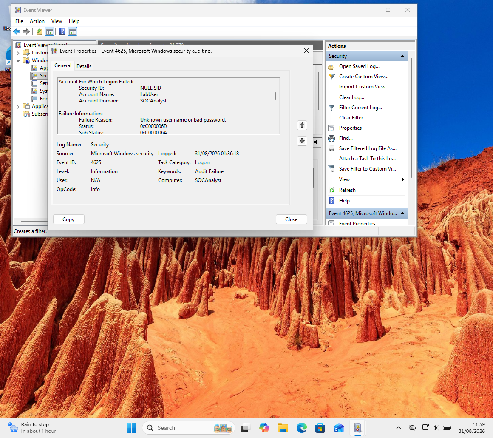
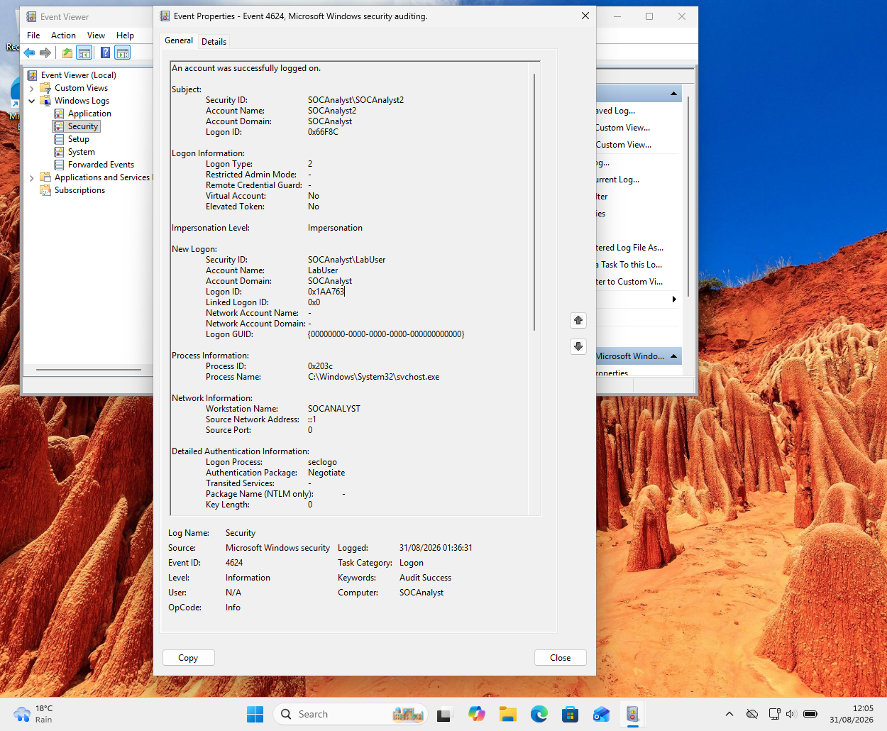
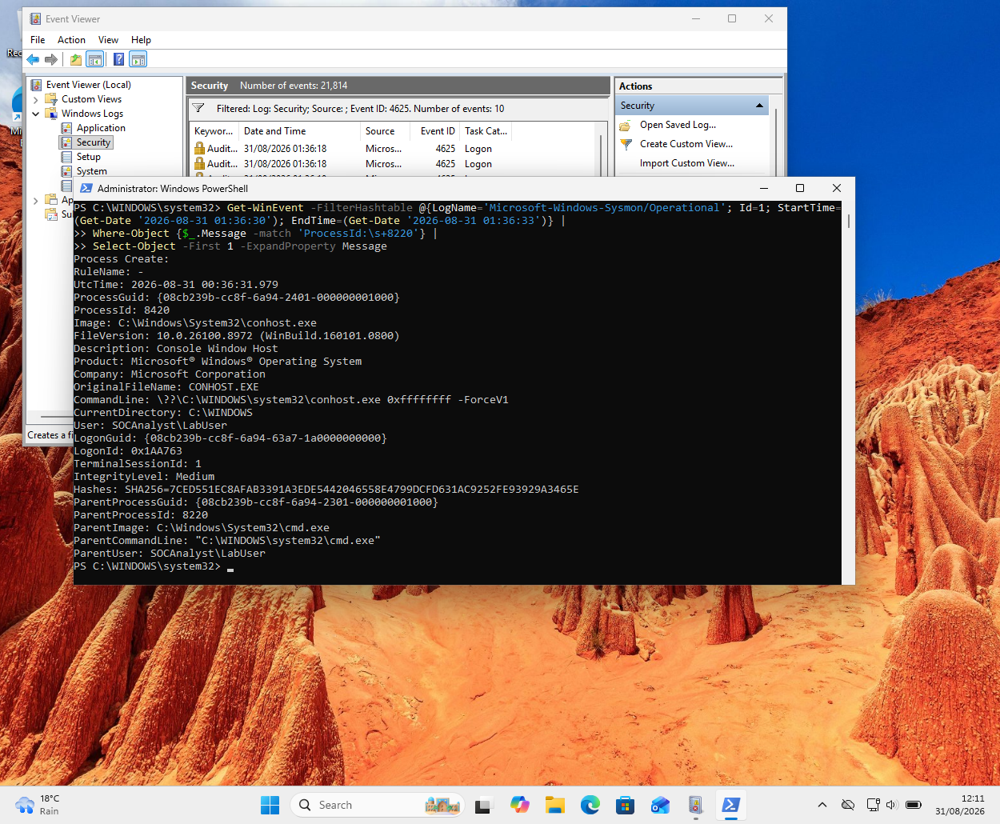

# Project 1 — Windows Authentication & Endpoint Investigation

## Overview

A hands-on SOC investigation conducted in a controlled Windows 11 laboratory environment.

The investigation examined a sequence of failed and successful authentication events and correlated Windows Security telemetry with Sysmon process-creation data.

## Scenario

Four failed authentication attempts against the `LabUser` account were recorded at:

**31/08/2026 01:36:18**

A successful interactive authentication occurred 13 seconds later:

**31/08/2026 01:36:31**

The authentication originated from the local host using the IPv6 loopback address `::1`.

## Investigation

### Failed Authentication — Event ID 4625

The failed authentication event identified:

- **Target account:** `LabUser`
- **Account domain:** `SOCAnalyst`
- **Subject account:** `SOCAnalyst2`
- **Logon Type:** `2 — Interactive`
- **Failure reason:** Unknown user name or bad password
- **Status:** `0xC000006D`
- **Sub-status:** `0xC000006A`
- **Source:** `::1`
- **Authentication Package:** `Negotiate`
- **Logon Process:** `seclogo`

### Successful Authentication — Event ID 4624

A successful authentication for `LabUser` occurred 13 seconds later.

Key evidence:

- **Account:** `SOCAnalyst\LabUser`
- **Logon Type:** `2 — Interactive`
- **Logon ID:** `0x1AA763`
- **Workstation:** `SOCANALYST`
- **Source:** `::1`
- **Authentication Package:** `Negotiate`
- **Logon Process:** `seclogo`

## Endpoint Correlation

Sysmon Event ID 1 recorded creation of:

`C:\Windows\System32\cmd.exe`

The process ran as:

`SOCAnalyst\LabUser`

The process contained the same Logon ID:

`0x1AA763`

This provided a direct correlation between the successful authentication and the subsequent `cmd.exe` process.

The parent process was:

`C:\Windows\System32\WindowsPowerShell\v1.0\powershell.exe`

running under:

`SOCAnalyst\SOCAnalyst2`

## System Discovery Activity

A separate LabUser session was subsequently used to execute:

- `whoami`
- `hostname`
- `ipconfig`

These commands are commonly used for system and network discovery.

The observed processes were associated with Logon ID:

`0x649075`

This differs from the original successful authentication Logon ID of `0x1AA763`.

Therefore, the discovery activity is documented as a **separate LabUser session** rather than being incorrectly attributed to the original authentication session.

## Process Relationship

    SOCAnalyst2
        |
        └── PowerShell (PID 8468)
                |
                └── cmd.exe (PID 8220)
                        |
                        └── conhost.exe (PID 8420)

    Logon ID: 0x1AA763
    User: SOCAnalyst\LabUser

    Separate discovery session:

    LabUser
        |
        └── cmd.exe (PID 352)
                ├── whoami.exe (PID 2247)
                ├── hostname.exe (PID 1708)
                └── ipconfig.exe (PID 4132)

    Logon ID: 0x649075

## Analyst Assessment

The initial authentication pattern warranted investigation because four failed authentication attempts against `LabUser` were followed by a successful authentication 13 seconds later.

The local source address `::1` is reassuring in the laboratory context, but local origin alone does not rule out malicious activity.

The successful authentication was strongly correlated with `cmd.exe` through the shared Logon ID `0x1AA763`.

The subsequent `whoami`, `hostname` and `ipconfig` commands are dual-use. They can be used for legitimate administration as well as early-stage reconnaissance.

Based on the controlled laboratory context and the absence of additional evidence indicating persistence, privilege escalation, credential access or malicious network activity, the final assessment was:

**Benign / Controlled Lab Activity**

## MITRE ATT&CK Mapping

| Technique | Name | Lab Activity |
|---|---|---|
| T1059.001 | PowerShell | PowerShell used in the controlled process workflow |
| T1059.003 | Windows Command Shell | `cmd.exe` used to execute commands |
| T1033 | System Owner/User Discovery | `whoami` |
| T1082 | System Information Discovery | `hostname` |
| T1016 | System Network Configuration Discovery | `ipconfig` |

These mappings describe behaviours represented in the laboratory exercise and do not by themselves indicate malicious activity.

## Skills Demonstrated

- Windows Event Log Analysis
- Authentication Analysis
- Security Event ID 4624 / 4625
- Sysmon Event ID 1
- Logon ID Correlation
- PowerShell
- Process Analysis
- Parent-Child Process Analysis
- Timeline Reconstruction
- System Discovery Analysis
- MITRE ATT&CK
- SOC Documentation
- Evidence-Based Incident Assessment

## Evidence

### Authentication Evidence

*Event ID 4625 showing the failed authentication against LabUser.*

*Event ID 4624 showing successful authentication of LabUser and Logon ID 0x1AA763.*

### Endpoint Evidence

*Sysmon Event ID 1 showing cmd.exe running as LabUser with LogonId 0x1AA763.*

*Supporting Sysmon process evidence from the investigation.*

## Project Documentation

[View the full investigation report](./Project_1_Windows_Authentication_Endpoint_Investigation_FINAL.pdf)
