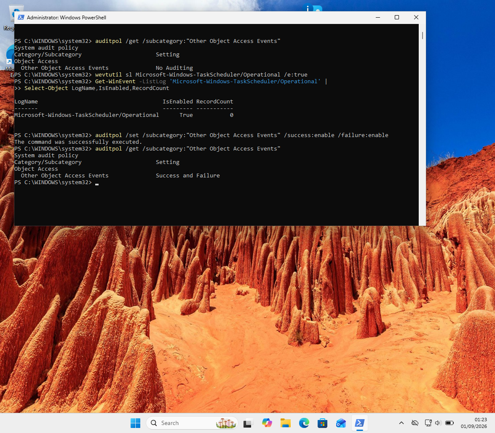
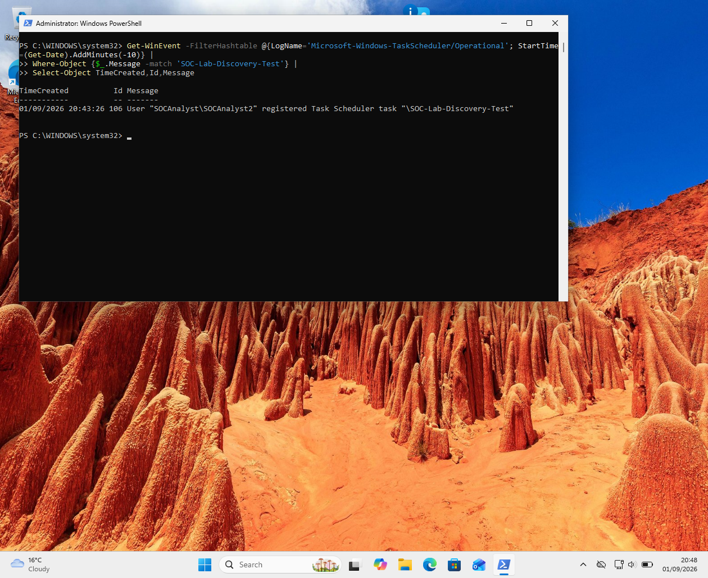

# Project 2 — Windows Scheduled Task Persistence Investigation

## Overview

This project investigates a controlled Windows scheduled-task persistence simulation in a Windows 11 SOC lab.

A harmless scheduled task named `SOC-Lab-Discovery-Test` was created with the action:

C:\Windows\System32\whoami.exe

The investigation focused on identifying scheduled-task creation, registration, launch activity, and process-execution telemetry.

The project emphasizes evidence correlation and distinguishes confirmed telemetry from activity that could not be independently verified.

---

## Objectives

- Create a controlled scheduled task in a Windows 11 lab
- Enable relevant Windows auditing and Task Scheduler telemetry
- Investigate Security Event ID 4698
- Investigate Task Scheduler Operational events
- Examine the scheduled task configuration
- Attempt to correlate task execution with Sysmon process telemetry
- Reconstruct an evidence-based timeline
- Document telemetry gaps without making unsupported assumptions
- Map the activity to MITRE ATT&CK

---

## Lab Environment

**Platform:** Windows 11

**Virtualization:** Oracle VirtualBox

**Endpoint:** SOC-Lab-Win11 / SOCANALYST

**Primary lab user:** `SOCAnalyst2`

**Sysmon service:** `Sysmon`

**Scheduled task:** `SOC-Lab-Discovery-Test`

### Scheduled Task Configuration

**Action:** `C:\Windows\System32\whoami.exe`

**Arguments:** None

**User:** `SOCAnalyst2`

**Logon Type:** Interactive

**Run Level:** Limited

**Task State:** Enabled

---

## Telemetry Sources

### Windows Security Log

Security Event ID **4698** was used to identify scheduled-task creation.

### Task Scheduler Operational Log

The following events were examined:

- **106** — Task registered
- **110** — Task instance launched
- **325** — Task instance queued
- **200/201** — Used to investigate action launch/completion telemetry

### Sysmon

Sysmon Event ID **1 — Process Create** was used to search for evidence of `whoami.exe` execution.

---

## Investigation Timeline

| Time | Source | Event | Finding |
|---|---|---:|---|
| 20:43:26 | Windows Security | 4698 | Scheduled task created |
| 20:43:26 | Task Scheduler | 106 | Task registered by `SOCAnalyst2` |
| 20:56:20 | Task Scheduler | 110 | Task instance launched |
| 20:56:20 | Task Scheduler | 325 | Task instance queued |
| 20:56:20 | ScheduledTaskInfo | — | `LastRunTime` recorded and `LastTaskResult = 0` |
| Post-run | Task Scheduler / Sysmon | — | No independent `whoami.exe` execution observed |

---

## Key Findings

### Finding 1 — Scheduled task creation confirmed

Windows Security Event ID 4698 confirmed creation of:

`SOC-Lab-Discovery-Test`

Task Scheduler Event ID 106 also recorded registration of the task by:

`SOCAnalyst\SOCAnalyst2`

### Finding 2 — Task action identified

The configured action was:

`C:\Windows\System32\whoami.exe`

The task ran under an interactive user context with a limited run level.

### Finding 3 — Task launch activity confirmed

At 20:56:20, Task Scheduler generated:

- Event 110 — task instance launched
- Event 325 — task instance queued

### Finding 4 — Process execution not independently confirmed

Although:

`LastTaskResult = 0`

and:

`LastRunTime = 01/09/2026 20:56:20`

were reported by `Get-ScheduledTaskInfo`, no matching Sysmon Event ID 1 for `whoami.exe` was observed.

No task-specific Event 200/201 action telemetry was identified either.

Therefore, the investigation does **not** claim that `whoami.exe` definitely executed.

---

## Telemetry Gap

The investigation identified a discrepancy between Task Scheduler state information and independent process telemetry.

The scheduler reported a successful result, but the expected `whoami.exe` process was not observed in Sysmon.

This demonstrates an important SOC investigation principle:

> A scheduler status field should not automatically be treated as proof of endpoint process execution.

The correct conclusion is that task creation and scheduler activity were confirmed, while actual process execution remained unconfirmed from the available telemetry.

---

## Detection Opportunities

A SOC analyst could investigate:

- Newly created scheduled tasks
- Unusual task names
- Tasks created outside expected administrative workflows
- Suspicious executable paths
- PowerShell or command-shell actions
- Tasks running with elevated privileges
- Tasks created under unexpected accounts
- Task creation followed by suspicious process creation
- Persistence through unusual scheduled-task triggers

Correlation between scheduled-task telemetry and Sysmon process creation can provide additional context.

---

## MITRE ATT&CK Mapping

### T1053.005 — Scheduled Task/Job: Scheduled Task

The primary technique demonstrated by this controlled lab is:

**T1053.005 — Scheduled Task/Job: Scheduled Task**

The lab created and launched a Windows scheduled task to simulate a persistence mechanism.

The configured `whoami.exe` action is a system/user discovery command, but because execution was not independently confirmed through Sysmon, it is not treated as confirmed discovery activity in the final assessment.

---

## Tools Used

- Windows 11
- Windows Event Viewer
- PowerShell
- Sysmon
- Task Scheduler
- `auditpol`
- `wevtutil`
- Oracle VirtualBox
- GitHub

---

## Evidence

### 1. Sysmon Service Running

### 2. Task Scheduler Auditing Enabled

### 3. Scheduled Task Created

### 4. Scheduled Task Action

### 5. Security Event 4698 — Scheduled Task Creation

### 6. Task Scheduler Operational Event

---

## Final Assessment

**BENIGN / CONTROLLED LAB ACTIVITY**

The investigation successfully demonstrated scheduled-task creation and scheduler telemetry in a controlled Windows environment.

The evidence confirmed:

- Scheduled task creation
- Task registration
- Task configuration
- Task launch/queue activity

The evidence did **not** independently confirm execution of `whoami.exe`.

The investigation therefore avoids overstating the evidence and records the process-execution telemetry gap as a finding.

---

## Lessons Learned

This investigation reinforced several SOC analysis skills:

- Windows event log analysis
- Scheduled-task investigation
- Timeline reconstruction
- Cross-source correlation
- Sysmon process analysis
- Evidence validation
- Detection thinking
- MITRE ATT&CK mapping
- Documenting telemetry limitations

The key lesson was to distinguish between **what the logs prove** and **what the analyst might reasonably infer**.

---

## Project Files

The full investigation report is available as a PDF:

`Project_2_Windows_Scheduled_Task_Persistence_Investigation_FINAL.pdf`

The report contains the investigation methodology, evidence timeline, findings, telemetry limitations, detection opportunities, MITRE ATT&CK mapping, and final assessment.
