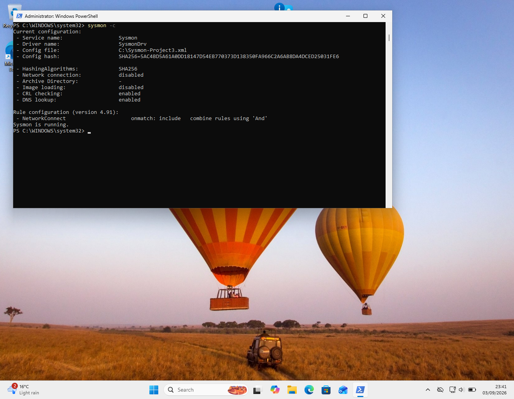
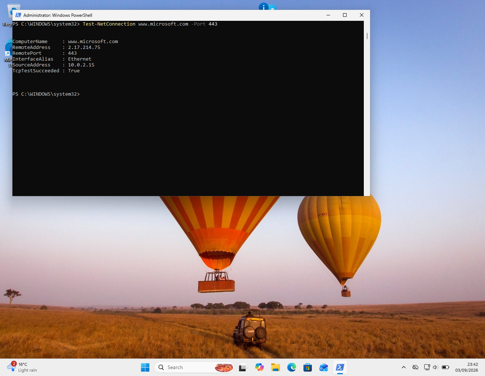
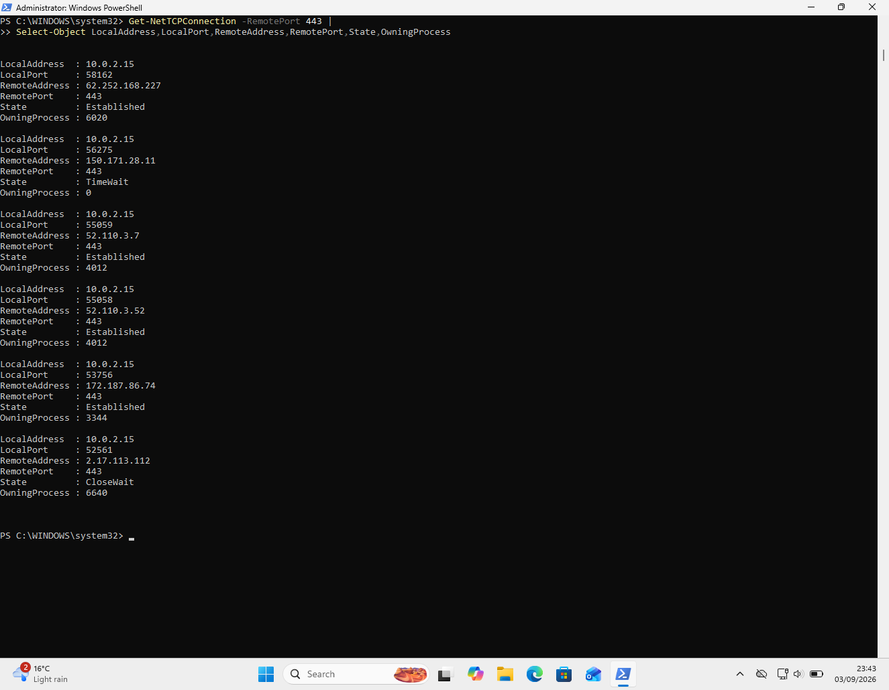
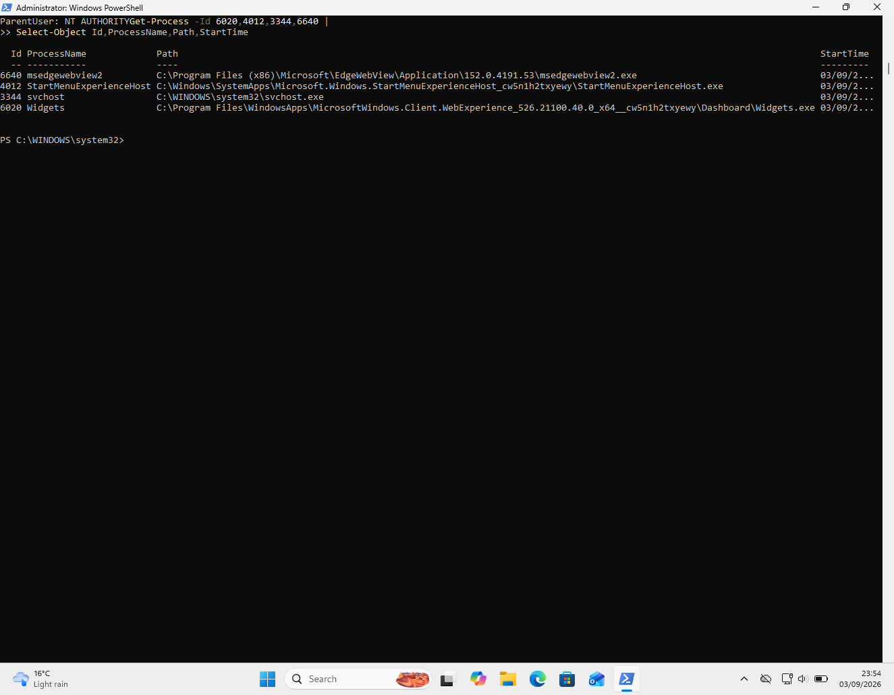
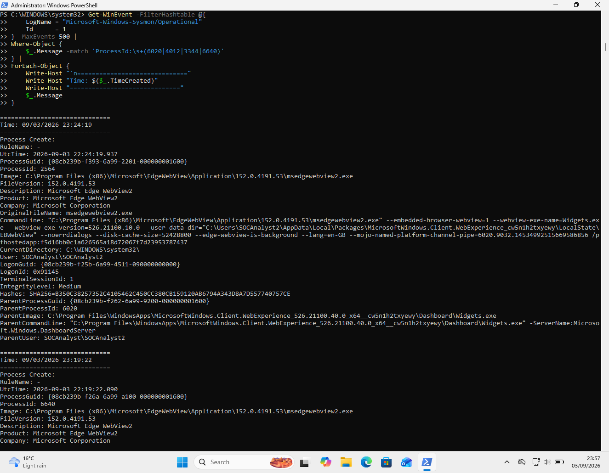
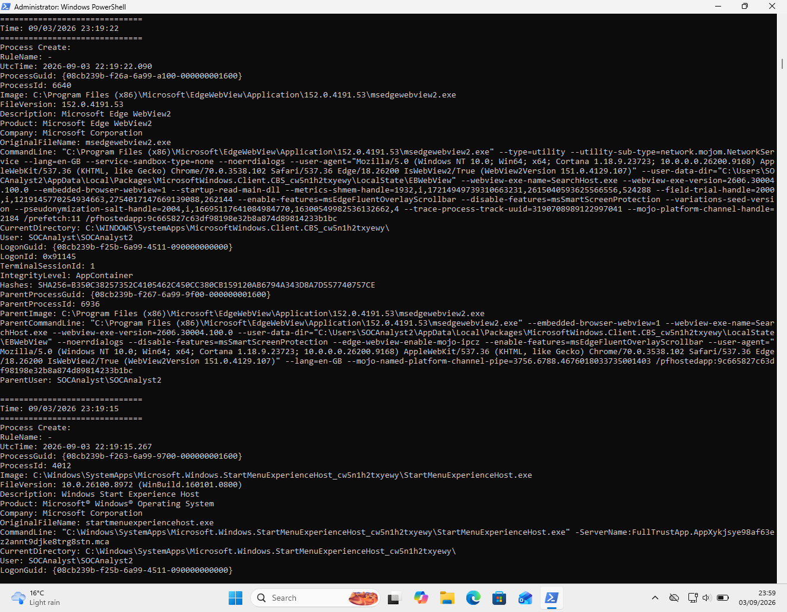
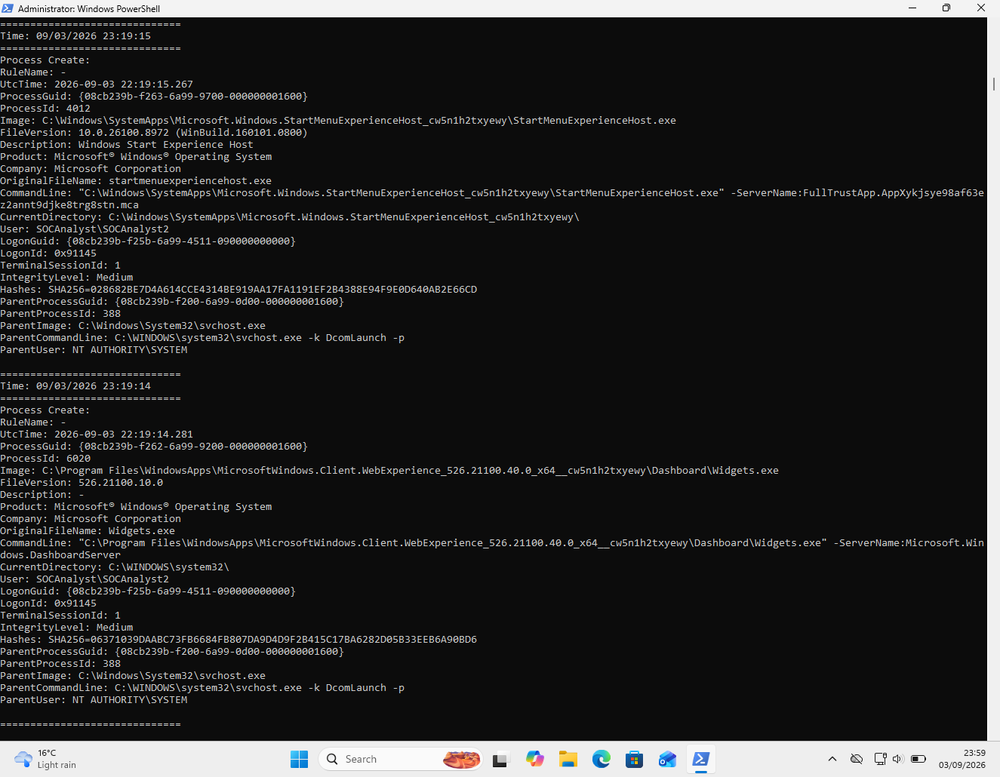
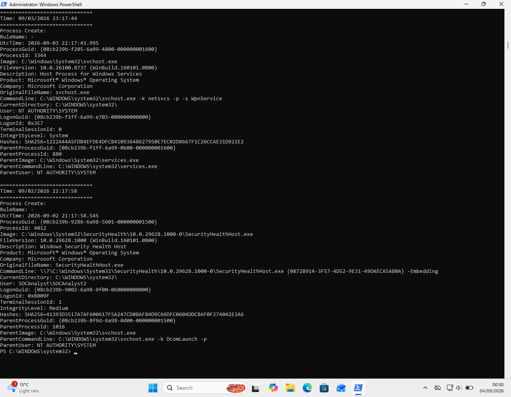

# Project 03 — Windows Network Connection & Endpoint Investigation

## Overview

This project demonstrates a controlled SOC investigation of outbound network activity on a Windows 11 endpoint.

The investigation focuses on:

- Validating outbound TCP/HTTPS connectivity
- Identifying active network connections
- Mapping network connections to owning processes
- Correlating process IDs with Sysmon Process Create (Event ID 1)
- Reviewing user/session, parent-process and integrity context
- Validating Sysmon NetworkConnect (Event ID 3) telemetry
- Identifying and documenting an endpoint telemetry gap
- Assessing observed activity as benign or suspicious

> **Environment:** Controlled Windows 11 SOC laboratory VM  
> **Endpoint IP:** `10.0.2.15`

---

## Investigation Objective

The objective was to determine whether outbound network activity could be observed on the endpoint, identify the responsible process where possible, correlate that process with its execution context, and assess whether the observed activity appeared benign or suspicious.

A secondary objective was to validate whether Sysmon Event ID 3 was actually providing the expected network-connection telemetry.

---

## Telemetry Used

### Sysmon

- Sysmon service: `Sysmon`
- Sysmon driver: `SysmonDrv`
- Log: `Microsoft-Windows-Sysmon/Operational`
- Event ID 1 — Process Create
- Event ID 3 — NetworkConnect

### Native Windows telemetry

- `Test-NetConnection`
- `Get-NetTCPConnection`
- `Get-Process`
- PowerShell filtering of Sysmon Event ID 1

---

## Investigation Workflow

```text
Controlled HTTPS test
        |
        v
Windows TCP telemetry
        |
        v
Owning Process PID
        |
        v
Process identification
        |
        v
Sysmon Event ID 1 correlation
        |
        +----> User / Logon ID
        |
        +----> Parent process
        |
        +----> Integrity level
        |
        v
Risk assessment
```

---

## 1. Sysmon Environment

Sysmon and its kernel driver were confirmed to be running.


---

## 2. Sysmon Network Telemetry Gap

The Sysmon configuration contained a `NetworkConnect` include filter, but the active Sysmon configuration reported:

```text
Network connection: disabled
```

This distinction is important: a configured filter does not by itself demonstrate that the underlying telemetry feature is actively generating events.



---

## 3. Controlled HTTPS Connection

A controlled outbound HTTPS test was performed:

```powershell
Test-NetConnection www.microsoft.com -Port 443
```

Observed result:

```text
RemoteAddress    : 2.17.214.75
RemotePort       : 443
SourceAddress    : 10.0.2.15
TcpTestSucceeded : True
```

This confirmed successful outbound TCP connectivity to the tested HTTPS destination.



---

## 4. Native Network Telemetry

Because Sysmon Event ID 3 was unavailable, Windows native TCP telemetry was used to observe active connections.

Example current connections included:

| PID | Destination | State |
|---:|---|---|
| 6020 | `62.252.168.227:443` | Established |
| 4012 | `52.110.3.7:443` | Established |
| 4012 | `52.110.3.52:443` | Established |
| 3344 | `172.187.86.74:443` | Established |
| 6640 | `2.17.113.112:443` | CloseWait |

`TIME_WAIT` entries with `OwningProcess : 0` were not attributed to a process because the originating process was no longer associated with those sockets.



---

## 5. Process Attribution

The owning PIDs were resolved to processes:

| PID | Process | Path |
|---:|---|---|
| 6020 | `Widgets.exe` | `C:\Program Files\WindowsApps\...\Dashboard\Widgets.exe` |
| 4012 | `StartMenuExperienceHost.exe` | `C:\Windows\SystemApps\...\StartMenuExperienceHost.exe` |
| 3344 | `svchost.exe` | `C:\Windows\System32\svchost.exe` |
| 6640 | `msedgewebview2.exe` | `C:\Program Files (x86)\Microsoft\EdgeWebView\...\msedgewebview2.exe` |

The executable locations are consistent with Windows/Microsoft components.



---

## 6. Sysmon Process Correlation

Sysmon Event ID 1 provided additional execution context.

### Widgets / WebView2 chain

PID `6020` was identified as:

```text
Widgets.exe
```

A related WebView2 process was observed with:

```text
User: SOCAnalyst\SOCAnalyst2
LogonId: 0x91145
TerminalSessionId: 1
IntegrityLevel: Medium
ParentImage: ...\Widgets.exe
```

The Edge WebView2 network-service process was also observed under the same interactive user context, with AppContainer integrity.

### Start Menu

PID `4012` was identified as:

```text
StartMenuExperienceHost.exe
```

with:

```text
User: SOCAnalyst\SOCAnalyst2
LogonId: 0x91145
TerminalSessionId: 1
IntegrityLevel: Medium
ParentImage: C:\Windows\System32\svchost.exe
ParentUser: NT AUTHORITY\SYSTEM
```

### Windows service

PID `3344` was:

```text
svchost.exe -k netsvcs -p -s WpnService
```

with:

```text
User: NT AUTHORITY\SYSTEM
LogonId: 0x3E7
TerminalSessionId: 0
IntegrityLevel: System
ParentImage: C:\Windows\System32\services.exe
```









---

## 7. PID Reuse Consideration

PID `4012` demonstrated why process IDs must not be treated as permanent identifiers.

A previous Event ID 1 record showed PID `4012` belonging to:

```text
SecurityHealthHost.exe
```

The current PID `4012` belonged to:

```text
StartMenuExperienceHost.exe
```

The investigation therefore used process creation time and Sysmon `ProcessGuid` context rather than assuming that PID `4012` represented the same process across time.

This is an important endpoint-investigation practice.

---

## 8. Sysmon Event ID 3 Validation

A controlled HTTPS connection succeeded, but querying the Sysmon operational log for Event ID 3 returned no records.

The active Sysmon configuration also explicitly reported:

```text
Network connection: disabled
```

### Finding

**Sysmon Event ID 3 network telemetry was unavailable on this endpoint despite the `NetworkConnect` filter being present.**

This is documented as a telemetry limitation. It is not evidence that network activity was absent.

---

## 9. Assessment

### Overall assessment

**Benign / Controlled Lab Activity — Low Suspicion**

Evidence supporting the assessment:

- The controlled HTTPS test succeeded normally.
- The observed executables were located in expected Windows/Microsoft application paths.
- The identified processes were Microsoft/Windows components.
- Parent-process and user/session contexts were consistent with normal Windows operation.
- No persistence, privilege escalation, credential access, or suspicious command-line behavior was identified in the collected evidence.

The assessment is intentionally limited to the telemetry available during the investigation.

---

## 10. Key SOC Finding — Telemetry Gap

The principal technical finding was not malicious network activity. It was a **visibility gap**.

Windows native TCP telemetry provided:

```text
Local IP -> Remote IP:Port -> Owning PID
```

Sysmon Event ID 1 then provided:

```text
PID -> Process -> User -> Logon ID -> Parent -> Integrity
```

However:

```text
Sysmon Event ID 3 -> unavailable
```

### SOC lesson

A SOC analyst should validate the complete telemetry path rather than assuming that a configured data source is producing the expected events.

This investigation demonstrates how analysts can:

1. Confirm network activity
2. Identify the owning process
3. Correlate process creation
4. Validate user/session context
5. Recognise telemetry limitations
6. Avoid unsupported conclusions

---

## MITRE ATT&CK Mapping

### T1049 — System Network Connections Discovery

Demonstrated through collection and analysis of active TCP connections.

### T1057 — Process Discovery

Demonstrated through identifying processes associated with network connection PIDs.

These mappings describe the investigative techniques demonstrated by the lab and **do not assert adversary activity**.

---

## Evidence Files

| Evidence | Purpose |
|---|---|
| `01-sysmon-environment-check.png` | Sysmon and driver running |
| `02-sysmon-telemetry-gap.png` | Sysmon NetworkConnect telemetry state |
| `03-controlled-network-connection.png` | Successful controlled HTTPS connection |
| `04-native-network-telemetry.png` | Process-attributable TCP connections |
| `05-process-attribution.png` | PID-to-process mapping |
| `06a–06d` | Detailed Sysmon process correlation and PID reuse |

---

## Key Commands

```powershell
Get-Service Sysmon,SysmonDrv

sysmon -c

Test-NetConnection www.microsoft.com -Port 443

Get-NetTCPConnection -RemotePort 443 |
Select-Object LocalAddress,LocalPort,RemoteAddress,RemotePort,State,OwningProcess

Get-Process -Id 6020,4012,3344,6640 |
Select-Object Id,ProcessName,Path,StartTime
```

Sysmon process correlation:

```powershell
Get-WinEvent -FilterHashtable @{
    LogName = "Microsoft-Windows-Sysmon/Operational"
    Id      = 1
} -MaxEvents 500 |
Where-Object {
    $_.Message -match 'ProcessId:\s+(6020|4012|3344|6640)'
}
```

---

## Conclusion

The investigation successfully demonstrated a practical Windows endpoint network investigation using native Windows TCP telemetry and Sysmon process telemetry.

The strongest finding was the identification of a **Sysmon Event ID 3 telemetry gap**. Rather than treating the absence of Event ID 3 as evidence of no network activity, the investigation used an alternative telemetry source to establish process-to-network visibility and then correlated those processes with Sysmon Event ID 1.

This demonstrates evidence-based SOC investigation, process correlation, awareness of PID reuse, and appropriate handling of telemetry limitations.
